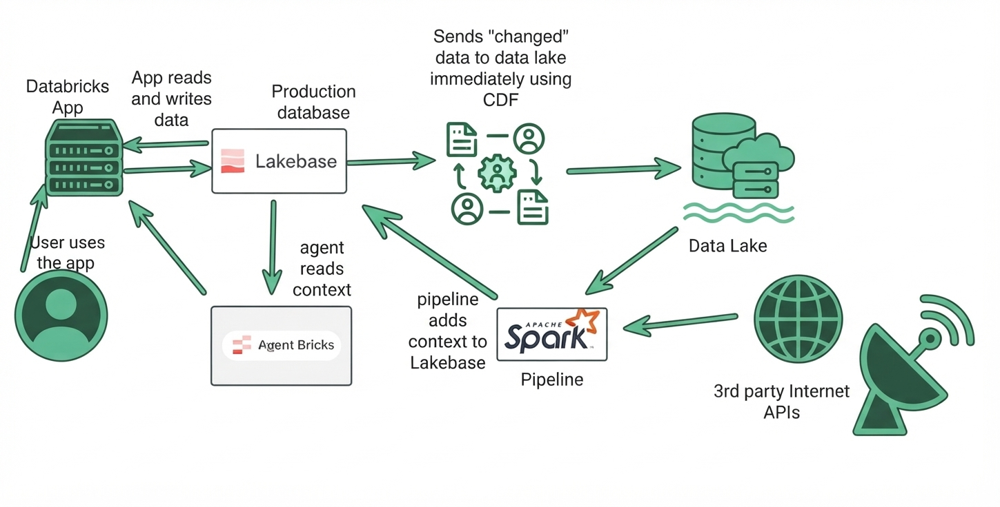

# Databricks Lakebase Weather Agent 🌧️

A production-grade, agentic weather intelligence system built on Databricks. It ingests real-time meteorological data from the National Weather Service (NWS) and Open-Meteo APIs, stores it in a Lakebase Postgres database, generates vector embeddings for semantic search, and exposes an AI agent through Model Context Protocol (MCP) tools — all deployable as Databricks Apps.

The agent answers questions like: *Do I need an umbrella in Dublin today?*, *What's the current temperature in Cork?*, and *Show me historical flood alerts similar to current conditions.* It combines live forecast data with vector similarity search over historical weather alert embeddings to deliver data-driven, context-aware recommendations.

---

## Architecture Diagram

**Data Flow:**
1. **3rd-party Internet APIs** (NWS, Open-Meteo) → **Apache Spark Pipeline** ingests and normalizes weather data
2. **Spark Pipeline** → **Lakebase** (Production Database) stores production data with vector embeddings
3. **Lakebase** → **Data Lake** sends "changed" data immediately using Change Data Feed (CDF)
4. **Data Lake** → **Spark Pipeline** provides historical context for enrichment
5. **Agent Bricks** reads context from **Lakebase** for intelligent recommendations
6. **User** interacts with **Databricks App**, which reads and writes data to **Lakebase**

---

## Motivation & Problem Statement

I live in Ireland — a country where the weather doesn't just change by the day, it changes by the hour and varies drastically across regions. A sunny morning in Dublin can give way to torrential rain by lunchtime, while Galway might experience entirely different conditions just 200 km away. Traditional weather apps provide generic forecasts, but they lack **agentic context**: the ability to reason about historical patterns, compare current conditions against similar past events, and deliver a confident, actionable recommendation.

**The core problem:** Existing weather services are passive data sources. They show you a forecast, but they don't *think* about it. They can't tell you *"Based on 12 similar weather patterns in your area, 8 resulted in rain — bring an umbrella"* — because they don't combine real-time data with historical vector similarity search.

This project solves that by building an end-to-end agentic pipeline that:

1. **Ingests** active weather alerts from the NWS API for all 50 US states and territories, normalizes the GeoJSON responses into a consistent schema, and upserts them into a production Lakebase Postgres database with idempotent deduplication.
2. **Generates vector embeddings** (384-dimensional, via `sentence-transformers/all-MiniLM-L6-v2`) from alert narrative text using a sliding-window chunking strategy (chunk size 800, overlap 100), enabling semantic similarity search with pgvector.
3. **Exposes an MCP server** with four AI tools — current weather, multi-day forecast, umbrella prediction, and weather news search — that an Agent Bricks agent can call to deliver intelligent, context-aware responses.

---

## Core Tech Stack

| Technology | Role |
|---|---|
| **Databricks** | Unified platform for compute, storage, app deployment, and Agent Bricks |
| **Apache Spark** | Distributed data processing for ingestion and transformation pipelines |
| **Lakebase (Postgres)** | Production OLTP database storing weather alerts and vector embeddings |
| **pgvector** | Postgres extension enabling cosine similarity search over 384-dim embeddings |
| **Agent Bricks** | Databricks AI agent framework consuming MCP tools for weather intelligence |
| **Delta Lake (CDF)** | Change Data Feed for syncing Lakebase changes to the Data Lake |
| **FastMCP** | Model Context Protocol server framework exposing tools to Agent Bricks |
| **Flask** | Web application framework for the Databricks App frontend and API |
| **Databricks Apps** | Serverless deployment platform for both the Flask app and MCP server |
| **Databricks Secrets** | Secure credential management for Lakebase connection URLs and API keys |
| **NWS API** | `api.weather.gov` — public government API for active weather alerts |
| **Open-Meteo API** | `api.open-meteo.com` — free API for current weather and multi-day forecasts |
| **sentence-transformers** | `all-MiniLM-L6-v2` model for generating semantic text embeddings |

---

## Architecture & Data Flow

The system follows a layered architecture with clear separation between ingestion, storage, vector indexing, and agentic serving.

### Step 1 — Third-Party API Data Ingestion

**NWS API (`api.weather.gov`):** The `WeatherAlertsClient` class fetches active weather alerts for all 50 US states plus territories (DC, PR, VI, GU, AS, MP) using the endpoint `GET /alerts/active/area/{state_code}`. Each state's GeoJSON response is parsed, and alert features are normalized into a flat schema with stable deduplication keys (the NWS alert ID), location descriptions, event types, narrative text (combining description + instruction), and ISO 8601 timestamps.

**Open-Meteo API (`api.open-meteo.com`):** The `weather_broker` module resolves location strings (city names, zip codes, or lat/lon coordinates) via the geocoding endpoint, then fetches current conditions (temperature, humidity, wind speed, pressure, weather code) and multi-day forecasts (up to 16 days) with daily high/low temperatures, precipitation probability, and precipitation sum.

### Step 2 — Spark Pipeline Processing

The ingestion pipeline runs as a Databricks notebook (`ingest_ticker_news_embeddings.py`) that:

1. Installs dependencies (`databricks-sdk`, `sentence-transformers`, `psycopg2`)
2. Connects to Lakebase using credentials stored in Databricks Secrets (scope: `database`, key: `lakebase-url`)
3. Fetches all active alerts via `WeatherAlertsClient.get_all_alerts()`
4. Upserts each alert into the `weather_information` table using `INSERT ... ON CONFLICT (id) DO UPDATE` for idempotent deduplication

**Databricks Workflow DAG - Unstructured Data Processing:**

*The Databricks workflow orchestrates the end-to-end pipeline: ingesting unstructured weather alert text, chunking narratives into 800-character segments with 100-character overlap, generating 384-dimensional embeddings via sentence-transformers, and upserting them into Lakebase with pgvector indexing for semantic search.*

### Step 3 — Lakebase Production Database

Data lands in two tables within the `dataexpert_student` database:

**`weather_information`** — Normalized alert records:

| Column | Type | Description |
|---|---|---|
| `id` | TEXT PK | NWS alert ID (stable dedup key) |
| `location` | TEXT | Area description + state code |
| `source_type` | TEXT | Always `"alert"` |
| `headline` | TEXT | Alert headline from NWS |
| `event` | TEXT | Event type (e.g., "Flash Flood Warning") |
| `narrative_text` | TEXT | Description + instruction combined |
| `issued_at` | TIMESTAMPTZ | When the alert was issued |
| `effective_at` | TIMESTAMPTZ | When the alert becomes effective |
| `expires_at` | TIMESTAMPTZ | When the alert expires |
| `payload` | JSONB | Raw GeoJSON feature for provenance |
| `synced_at` | TIMESTAMPTZ | When we fetched it (auto-defaults to `now()`) |

**`weather_alert_embeddings`** — Chunked and embedded text for semantic search:

| Column | Type | Description |
|---|---|---|
| `id` | TEXT | Unique chunk ID |
| `document_id` | TEXT | FK to `weather_information.id` |
| `chunk_index` | INT | Chunk position within the document |
| `location` | TEXT | Location from source alert |
| `event` | TEXT | Event type from source alert |
| `chunk_text` | TEXT | Sliding-window text chunk (800 chars, 100 overlap) |
| `embedding` | VECTOR(384) | MiniLM-L6-v2 embedding, pgvector indexed |

### Step 4 — Change Data Feed (CDF) Sync to Data Lake

Delta Lake's Change Data Feed captures row-level changes (inserts, updates, deletes) on the Lakebase-backed tables. As weather alerts are upserted — with new alerts arriving and expired alerts being updated — the CDF streams these changes into Delta tables in the Databricks Data Lake. This enables:

- **Historical trend analysis** across time-series weather data
- **Audit and provenance tracking** for every alert update
- **Downstream analytics** via Databricks SQL and dashboards without hitting the OLTP database
- **Versioned data** for reproducible ML training and pattern analysis

### Step 5 — Agent Bricks Supplying Real-Time Intelligence

The MCP server (`weather_mcp_server.py`) is deployed as a separate Databricks App and exposes four tools over the Model Context Protocol using FastMCP with streamable-HTTP transport:

1. **`get_current_weather(location)`** — Fetches real-time conditions (temperature, humidity, wind, pressure) from Open-Meteo. Supports city names, zip codes, and lat/lon coordinates with automatic geocoding.

2. **`get_forecast(location, days)`** — Retrieves multi-day forecasts (1–16 days) with daily high/low temperatures, precipitation probability, weather conditions, and precipitation sum.

3. **`predict_umbrella_needed(location, date)`** — The flagship tool. Combines:
   - Real-time Open-Meteo forecast for the target date
   - Vector similarity search over `weather_alert_embeddings` using pgvector's `<=>` cosine distance operator
   - A 40% precipitation probability threshold
   - Historical pattern analysis: if >60% of similar past events involved rain-related weather, confidence is boosted
   - Returns a boolean recommendation, confidence level (high/medium/low), detailed reasoning with supporting evidence, and the top 3 similar historical alerts with similarity scores

4. **`search_weather_news(weather_condition, max_results)`** — Semantic search across all historical weather alerts. Generates an embedding for the query condition (e.g., "flooding", "hurricane"), performs pgvector similarity search, groups results by location, and returns articles with excerpts, similarity scores, and Google News search links.

The Agent Bricks agent calls these tools via MCP, receiving structured JSON responses that it synthesizes into natural-language recommendations for the end user.

### Step 6 — Databricks App (Flask Web UI)

The Flask app (`app.py`) serves as the user-facing layer, deployed as a Databricks App:

- **`/`** — Web UI with a semantic search interface for weather alerts
- **`/healthz`** — Health check endpoint
- **`/alerts`** — List synced weather alerts from Lakebase (paginated)
- **`/alerts/sync`** — Trigger a full sync from the NWS API (all states or specified subset)
- **`/api/weather?state=CA`** — Get raw NWS alerts for a specific state
- **`/weather/search`** — Semantic search endpoint: accepts a natural-language query, embeds it with MiniLM-L6-v2, and returns the top-K most similar weather alerts from the embeddings table using pgvector cosine similarity

---

## Agent in Action

The Agent Bricks weather agent leverages the MCP tools to deliver intelligent, context-aware responses. Here are two key features in action:

### Feature 1: Umbrella Prediction with Historical Context

*The agent combines real-time forecast data with vector similarity search over historical weather patterns. When asked "Do I need an umbrella?", it analyzes precipitation probability, searches for similar past weather events in the embeddings table, and provides a confidence-scored recommendation with supporting evidence from historical alerts.*

### Feature 2: Semantic Weather Alert Search

*Natural language queries like "show me flood alerts" are embedded using the same MiniLM-L6-v2 model and matched against the pgvector index. The agent returns semantically similar weather alerts grouped by location, with similarity scores and excerpts from the narrative text, enabling users to discover relevant historical patterns without exact keyword matches.*

---

## Engineering Challenges & Solutions

### Challenge 1: Reliable API Data Ingestion at Scale

**Problem:** The NWS API returns GeoJSON responses with deeply nested feature structures, varying field availability, and inconsistent timestamp formats. Fetching alerts for all 56 states/territories sequentially is slow, and individual state failures must not abort the entire pipeline.

**Solution:** The `WeatherAlertsClient` uses a class-based design with session reuse for connection pooling, configurable timeouts, and proper `User-Agent` headers (required by the NWS API). Each state's request is wrapped in independent try/except blocks — a failure for one state logs the error and continues to the next. The `_normalize_alert` method safely extracts fields using `.get()` with sensible defaults, combines description + instruction into a single narrative, and parses ISO 8601 timestamps (including UTC `Z` suffix handling). A standalone sync script (`run_sync_standalone.py`) provides a fallback path that uses `LAKEBASE_URL` from environment variables instead of the Databricks SDK, working around SDK incompatibility with serverless compute.

### Challenge 2: Idempotent Upserts for Low-Latency State Updates

**Problem:** Weather alerts are continuously issued, updated, and expired. Re-syncing must not create duplicates, and existing records must be updated in place when alert details change (e.g., an alert's expiration time is extended).

**Solution:** Every alert uses the NWS alert ID as a stable primary key. The sync pipeline uses `INSERT INTO weather_information (...) VALUES (...) ON CONFLICT (id) DO UPDATE SET ...` — a Postgres upsert that atomically inserts new alerts or updates existing ones. This makes the sync fully idempotent: running it multiple times produces the same end state. The `synced_at` column is updated on every upsert, providing a freshness indicator for downstream consumers.

### Challenge 3: Semantic Search via pgvector at Inference Time

**Problem:** Traditional keyword search cannot match the semantic meaning of weather descriptions. "Risk of flooding near rivers" should match alerts about "Flash Flood Warning" even without exact word overlap.

**Solution:** Alert narrative text is chunked using a sliding window (chunk size 800 characters, overlap 100) to preserve context across boundaries. Each chunk is embedded using `sentence-transformers/all-MiniLM-L6-v2` (384 dimensions) and stored in the `weather_alert_embeddings` table with a pgvector index. At query time, the user's search text is embedded with the same model and compared using pgvector's `<=>` cosine distance operator. The model is lazy-loaded on first use to minimize cold-start latency, and `top_k` results are clamped to a 1–20 range to bound query cost.

### Challenge 4: Secure Credential Management Across Environments

**Problem:** The Lakebase connection URL contains credentials and must be accessible from Databricks Apps, notebooks, and the MCP server — but never hardcoded or committed.

**Solution:** The connection URL is base64-encoded and stored in Databricks Secrets (scope: `database`, key: `lakebase-url`). The `app.yaml` Databricks App config declares this as a resource with `READ` permission, injecting it as an environment variable at runtime. The `lakebase.py` helper module fetches and decodes it transparently using the Databricks SDK `WorkspaceClient`. For local development, `.env.example` documents the `LAKEBASE_URL` environment variable pattern. The standalone sync script supports both paths (SDK secrets or env var) for flexibility across compute environments.

### Challenge 5: Change Data Feed Sync to Data Lake

**Problem:** Lakebase serves as the production OLTP store, but analytics workloads (trend analysis, ML training, dashboarding) should not contend with transactional writes. Historical changes need to be tracked for audit and reproducibility.

**Solution:** Delta Lake's Change Data Feed (CDF) captures every row-level change to the weather tables — inserts, updates, and deletes — as versioned Delta tables in the Data Lake. This decouples analytical workloads from the OLTP database: dashboards and ML pipelines read from Delta tables, while the Flask app and MCP server continue to query Lakebase for low-latency real-time responses. CDF also provides a full audit trail of every alert update, enabling point-in-time reconstruction of weather state.